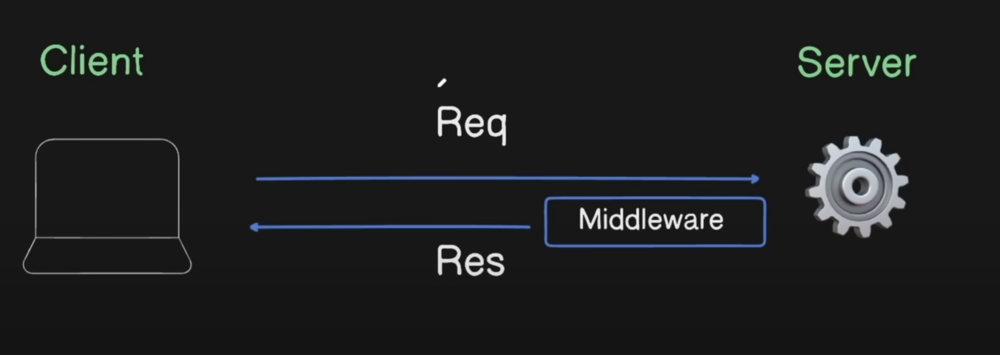
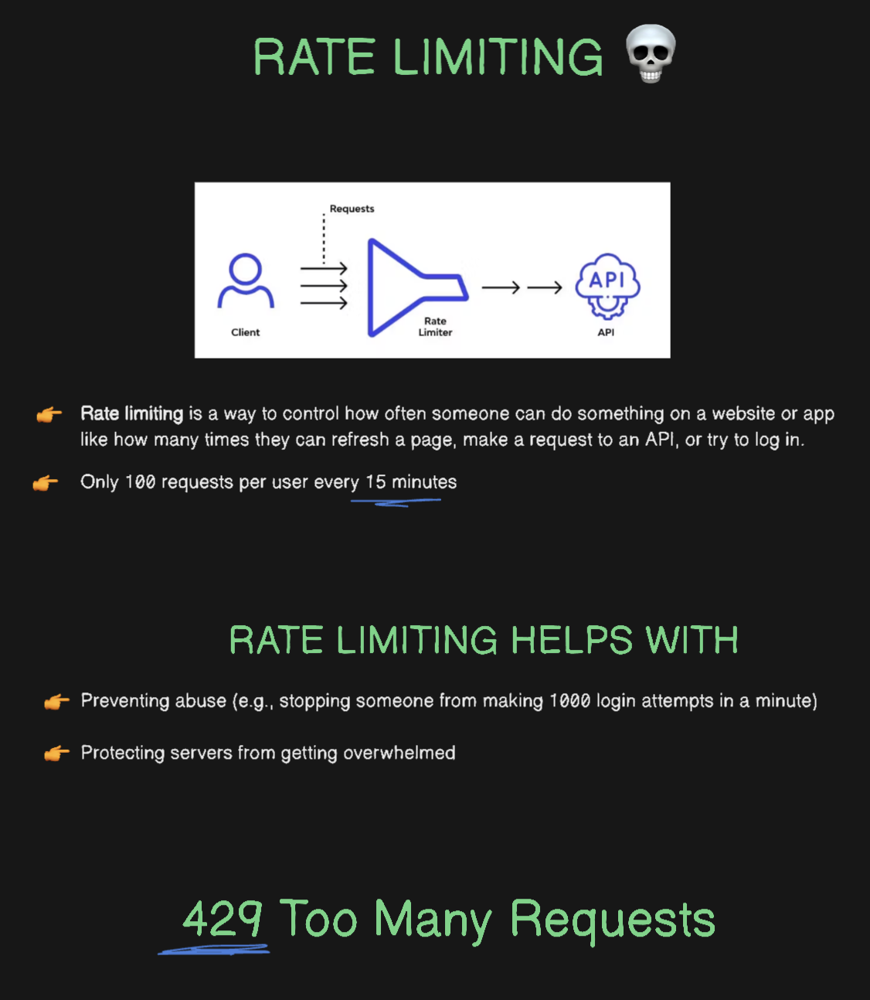

# NOTES FOR MERN

## BACKEND

> 28 June 2025

1. install express
2. set up express app
3. set "type":"module" in package.json for import/export
4. install nodemon as a dev dependency: "npm install nodemon -D" for hot reload
5. set up scripts:
   "scripts": {
   "dev": "node server.js",
   "start": "nodemon server.js"
   },
6. Set up the routes

### Setting up the ROUTER

```
FILE STRUCTURE
-backend/
--server.js
|-node_modules/
|-routes/
---notesRoutes.js
```

**server.js Before creating the routes:**

```
import express from "express";

const app = express();

app.get("/api/notes", (req, res) => {
  res.status(200).send("You got 10 notes");
});


app.post("/api/notes", (req, res) =>
  res.status(201).json({ message: "A new note using post is created successfully" })
);

app.put("/api/notes/:id", (req, res) => {
  res.status(200).json({ message: "Note updated using put successfully" });
});

app.delete("/api/notes/:id", (req, res) => {
  res.status(200).json({ message: "Note Deleted successfully" });
});
app.listen(5001, () => console.log("Server started on port 5001"));

```

**server.js After creating the routes(notesRoutes.js):**

```
import express from "express";
import notesRoutes from "./routes/notesRoutes.js";

const app = express();

app.use("/api/notes", notesRoutes);

app.listen(5001, () => console.log("Server started on port 5001"));
```

**with notesRoutes.js:**

```
import express from "express";
const router = express.Router();

router.get("/", (req, res) => {
  res.status(200).send("You got 10 notes");
});
router.post("/", (req, res) => {
  res.status(201).json({ message: "A new note using post is created successfully" });
});
router.put(":id", (req, res) => {
  res.status(200).json({ message: "Note updated using put successfully" });
});
router.delete(":id", (req, res) => {
  res.status(200).json({ message: "Note Deleted successfully" });
});

export default router;
```

Here, in server.js, we created app.use("/api/notes", notesRoutes). It means whenever a url starts with "/api/notes", we need to hit up "notesRoutes" file to see what block of code needs to be executed next based on the route and the http request method. In notesRoutes.js, there will be all the methods and teh corresponding block of codes/instructions that need to be executed for that method and url

### Setting up CONTROLLERS

- =>Create a new folder **controllers**
- => Create the controller in camelCase (ex: notesController.js)
- => These are the functions to be executed after a specific http request is sent to a specific url:

```
router.get("/", controller);
```

### Remodularising code structure

```
-backend
---src/
-----controllers/
-------notesController.js
-----routes/
-------notesRoutes.js
-----server.js
```

> 29 June 2025

### Connecting with mongodb

```
npm install mongoose
```

- => Create a **config** folder
- => In it, create a **db.js** file
- => Go to mongodb and create a new project
- => Get the connection string and to name the database, in the connection string where "mongodb.net/?" is present, put the database name between the "/" and "?" as follows:

```
mongodb+srv://<db_user>:<db_password>@cluster0.abcdef.mongodb.net/database_name?retryWrites=true&w=majority&appName=Cluster0
```

=>**db.js**

```
import mongoose from "mongoose";
export const connectDB = async () => {
  try {
    await mongoose.connect(
      "mongodb+srv://<db_user>:<db_password>@cluster0.abcdef.mongodb.net/database_name?retryWrites=true&w=majority&appName=Cluster0"
    );
    console.log("MongoDB Connected Successfully!");
  } catch (error) {
    console.error("Error while connecting to mongodb, ", error);
    process.exit(1); //exit with failure
  }
};

```

But it is **insecure** to use credentials of mongodb directly in our code. For that we use a .env file in the backend folder

=>**.env**

```
MONGO_URI= "mongodb+srv://<db_user>:<db_password>@cluster0.abcdef.mongodb.net/database_name?retryWrites=true&w=majority&appName=Cluster0"
PORT=5001
```

So, to use this we need another package called "dotenv"

```
npm i dotenv
```

Using this package, we can access the ".env" file using **"process.env.VARIABLE_NAME"** after importing dotenv and calling config() function on dotenv:
=>**server.js**

```
import dotenv from "dotenv";
dotenv.config();
//everything will be accessible in all files because server.js serves as the entry point to the backend

```

=>**db.js**

```
import mongoose from "mongoose";
export const connectDB = async () => {
  try {
    await mongoose.connect(process.env.MONGO_URI);
    console.log("MongoDB Connected Successfully!");
  } catch (error) {
    console.error("Error while connecting to mongodb, ", error);
    process.exit(1); //exit with failure
  }
};
```

### Creating Models For Database

- => To create Models, first create **models** folder and in that you create the schema and models
- => Keep in mind that the file name must be **Singular** and should start with **Capital Letter**(eg: Note.js and not: ~~note.js~~, ~~Notes.js~~ )
  => **Note.js**

```
import mongoose from "mongoose";
//1- CREATE A SCHEMA
const noteSchema = new mongoose.Schema(
  {
    title: {
      type: String,
      required: true,
    },
    content: {
      type: String,
      required: true,
    },
    // here we could have added timestamp
  },
  //but mongodb by default provides "createdAt" and "updatedAt" timestamps by default, so we added that "timestamps : true" as a separate object to access those from mongodb
  { timestamps: true }
);
//2- MODEL based off of THAT schema
const Note = mongoose.model("Note", noteSchema);

export default Note;
//we will be using this note to interact with the Note Collection => get, create, update, delete

```

> [!NOTE]
> We can add timestamp in here but mongodb by default provides "createdAt" and "updatedAt" timestamps by default, so we added that "timestamps : true" as a separate object to access those from mongodb
> { timestamps: true }

### Writing Controller Functions

Now that the setup for backend is almost completed, we need to work on the controllers, i.e. the functions that will get executed on calling of a specific url with a specific HTTP request.

- Make controllers **async** functions because there will be **Pormises** involved
- Add a **try & catch** block in the controllers to catch errors
- To get all documents related to a collection, we use : **ModelName.find()**
- To find a specific document in a collection, we use: **ModelName.find({\_id:"something"})** so some other identity key pair value
- status(200): everything worked fine
  status(201): something created successfully
  status(400): Bad request error
  status(401): Unauthorized
  status(404): Forbidden
  status(404): something not found
  status(429): Too Many Requests
  status(500): Internal Server Error
  status(503): Service Unavailable

- Example controller(getting all notes):

```
import Note from "../models/Note.js";
export async function getAllNotes(req, res) {
  try {
    const notes = await Note.find().sort({ createdAt: -1 });
    //sorting in descending order, newest first
    res.status(200).json(notes);
  } catch (error) {
    console.error("Error in getAllNotes:", error);
    res.status(500).json({ message: "Internal Server Error" });
  }
}
```

- To test the api endpoints, use **"Postman"**
  - Create a new http request
  - In the form, enter the url (ex: http://localhost:5001/api/notes)
  - Select the method type (ex: put, get , post)
  - If no request parameters, Click send
- To **Create** something, we must be having some data that is coming from the frontend. So, to access **that** data, in our **server.js**, we will use **middleware** so that the data from the frontend can be parsed by the backend and is accessible to be read by backend using :

```
app.use(express.json());
```

but keep in mind that it must be written before the Routes i.e.:

```
import express from "express";
import notesRoutes from "../src/routes/notesRoutes.js";
import { connectDB } from "./config/db.js";
import dotenv from "dotenv";
dotenv.config();
const PORT = process.env.PORT || 5001;
const app = express();
connectDB();
//middleware
app.use(express.json()); //<======================here
app.use("/api/notes", notesRoutes);

app.listen(PORT, () => console.log("Server started on PORT :", PORT));

```

- Example controller (creating a note):

```
export async function createNote(req, res) {
  try {
    //parsing data
    const { title, content } = req.body;
    //creating a new note=> we could also use {title, content} since key-value pairs are same
    const newNote = new Note({ title: title, content: content });
    //storing it in the database
    await newNote.save();
    res.status(201).json({ message: "note created successfully" });
  } catch (error) {
    console.error("Error in createNote controller:", error);
    res.status(500).json({ message: "Internal Server Error" });
  }
}
```

- To test createNote:

  - url:http://localhost:5001/api/notes
  - method:post
  - in body => select raw => json(select)
  - type in the body data in json format
  - click send

- Example controller (updating a note):
  - **findByIdAndUpdate(req.params.id, {data_to_be_updated}, {options})**
  - **req.params.id** is used to get the id from url
  - **options** => {new:true} => returns the updated value, if it was empty object, then the document without the updated value would have been returned
  - make sure to handle edge cases, like what if id doesn't exist, or is wrong etc.

```
export async function updateNote(req, res) {
  try {
    //getting data from frontend and parsing it
    const { title, content } = req.body;
    //find the note in database and update it
    const updatedNote = await Note.findByIdAndUpdate(
      req.params.id,
      {
        title,
        content,
      },
      { new: true }
    );
    //const note= Model.findByIdAndUpdate(req.params.id, {data_to_be_updated}); <= returns the old note
    //const note= Model.findByIdAndUpdate(req.params.id, {data_to_be_updated}, {new:true}); <= returns the new note after updation
    if (!updatedNote)
      return res.status(404).json({ message: "Note not found" });

    res.status(201).json(updatedNote);
  } catch (error) {
    console.error("Error in updateNote controller:", error);
    res.status(500).json({ message: "Internal Server Error" });
  }
}
```

> [!IMPORTANT]
> const note= Model.findByIdAndUpdate(req.params.id, {data_to_be_updated}); <= returns the old note </br>
> const note= Model.findByIdAndUpdate(req.params.id, {data_to_be_updated}, {new:true}); <= returns the new note after updation

- Example controller (deleting a note):

```
export async function deleteNote(req, res) {
  try {
    const deletedNote = await Note.findByIdAndDelete(req.params.id);
    if (!deletedNote)
      return res.status(404).json({ message: "Note not found" });
    res.status(200).json({ message: "Note deleted successfully" });
  } catch (error) {
    console.error("Error in deleteNote controller:", error);
    res.status(500).json({ message: "Internal Server Error" });
  }
}
```

### Middleware

Middleware is a function that runs in the middle between the **request** and the **response**


To **Create** something, we must be having some data that is coming from the frontend. So, to access **that** data, in our **server.js**, we will use **middleware** so that the data from the frontend can be parsed by the backend and is accessible to be read by backend using :

```
app.use(express.json());
```

This will help us get access to **req.body** which we send as json from frontend

> [!IMPORTANT]
> app.use(express.json()); must be written before the routes are written in the server.js

Example:

```
//middleware
app.use(express.json()); //<==================== this middleware parses JSON bodies

app.use((req, res, next) => {
  console.log(`req method is ${req.method} and req url is ${req.url}`);
  next();
});//<==================== our simple custom middleware
```

- Now if we use postman to hit the endpoint "http://localhost:5001/api/notes" with GET method; then first we will get a console log of :

  - **req method is GET and req url is /api/notes**
  - Then, the corresponding controller (**getAllNotes** in this case) will execute normally

- Another example is when we are trying to post something on instagram, we send a request, the middleware runs to check if the user is authenticated or not, if they're authenticated; only then the post will be created.

- Middleware is mostly used for **authentication check**

### Rate Limiting



- To apply rate limits , we will use upstash

  - url: https://upstash.com/
  - in upstash, we will use **Redis**, which is a serverless key-value store, just like a no-sql database, but instead of collections like mongodb, we have key-value pairs
  - In upstash > Redis > Create Database

    - Give it a name
    - Select the closest time-zone
    - Keep everything else as it is, for the free plan, click next and then create.
    - Get the **.env variables** from there: UPSTASH_REDIS_REST_URL, UPSTASH_REDIS_REST_TOKEN
    - install the package:

    ```
    npm i @upstash/ratelimit @upstash/redis
    ```

    - documentation : https://upstash.com/docs/redis/sdks/ratelimit-ts/gettingstarted#npm
    - In the **config** folder, create **upstash.js**:

    ```
    import { Ratelimit } from "@upstash/ratelimit";
    import { Redis } from "@upstash/redis";

    import dotenv from "dotenv";
    dotenv.config();
    const ratelimit = new Ratelimit({
      redis: Redis.fromEnv(),
      //creating a ratelimiter that allows 10 requests per 20 seconds
      limiter: Ratelimit.slidingWindow(10, "20 s"),
    });

    export default ratelimit;
    ```

    - Create src/middleware
    - Create middleware/rateLimiter.js
    - **rateLimiter.js**
      - const identifier = "api";
      - const { success } = await ratelimit.limit(identifier);
      - we use it for "per person" to identify a user because if rate limit for user1 has reached; it shouldn't affect user2
      - Use a constant string to limit all requests with a single ratelimit
      - Or use a userID, apiKey or ip address for individual limits.
      - In our code: if any user sends 100 requests per minute, services will be blocked for all the users. This is why we need an identifier to block service per user like a user_id or IP address etc.

    ```
    **rateLimiter.js**

    import ratelimit from "../config/upstash.js";

    const rateLimiter = async (req, res, next) => {
      try {
        const { success } = await ratelimit.limit("my-limit-key");
        //const identifier = "api";
        // const { success } = await ratelimit.limit(identifier);
        //we use it for "per person" to identify a user because if rate limit for user1 has reached; it shouldn't affect user2
        // Use a constant string to limit all requests with a single ratelimit
        // Or use a userID, apiKey or ip address for individual limits.
        if (!success) {
          return res.status(429).json({
            message: "Too many requests, please try again later",
          });
        }
        next();
      } catch (error) {
        console.error("Rate Limit Error : ", error);
        next(error);
      }
    };
    export default rateLimiter;
    ```

    - Use this **ratelimiter in server.js** before Routes:

    ```
    import express from "express";
    import notesRoutes from "../src/routes/notesRoutes.js";
    import { connectDB } from "./config/db.js";
    import dotenv from "dotenv";
    import rateLimiter from "./middleware/rateLimiter.js";
    dotenv.config();
    const PORT = process.env.PORT || 5001;
    const app = express();

    connectDB();
    //middleware
    app.use(express.json());
    app.use(rateLimiter);


    app.use("/api/notes", notesRoutes);

    app.listen(PORT, () => console.log("Server started on PORT :", PORT));

    ```

    - Output in terminal:

    ```
    Server started on PORT : 5001
    MongoDB Connected Successfully!
    ```

    - Now this states that server is started first and then db is connected which is not a good practice. Instead, connect to db first and then start the server by replacing the code with :

    ```
    import express from "express";
    import notesRoutes from "../src/routes/notesRoutes.js";
    import { connectDB } from "./config/db.js";
    import dotenv from "dotenv";
    import rateLimiter from "./middleware/rateLimiter.js";
    dotenv.config();
    const PORT = process.env.PORT || 5001;
    const app = express();

    //middleware
    app.use(express.json());
    app.use(rateLimiter);

    app.use("/api/notes", notesRoutes);
    connectDB().then(() => {
      app.listen(PORT, () => console.log("Server started on PORT :", PORT));
    });

    ```

    - Now the Output in terminal:

    ```
    MongoDB Connected Successfully!
    Server started on PORT : 5001
    ```

### Setting up CORS

- Cross-Origin Resource sharing
- a browser security rule
- When a website tries to get data from another website (like your frontend calling an API on different domain), the browser might block it for security reasons
- Example:

  - You've a frontend at :http://localhost:3000
  - And an API backend at: http://api.example.com
  - Your frontend makes a **fetch** request to get data from "http://api.example.com/users"
  - But the browser says: _You're coming from **localhost:3000** and you're trying to access **api.example.com**, which is a different origin. I need to make sure that the API allows this_

- Install **cors** to get rid of this error.

```
npm i cors
```

- In the **server.js**, add _app.use(cors{origin:"frontend_url_string"})_ in the middleware section, before the ratelimiter and parsing using _app.use(express.json())_:

```
import express from "express";
import dotenv from "dotenv";
import cors from "cors";
import notesRoutes from "../src/routes/notesRoutes.js";
import { connectDB } from "./config/db.js";
import rateLimiter from "./middleware/rateLimiter.js";
dotenv.config();
const PORT = process.env.PORT || 5001;
const app = express();

//middleware
app.use(
  cors({
    origin: "http://localhost:5173",
  })
);
app.use(express.json());
app.use(rateLimiter);

app.use("/api/notes", notesRoutes);
connectDB().then(() => {
  app.listen(PORT, () => console.log("Server started on PORT :", PORT));
});
```
